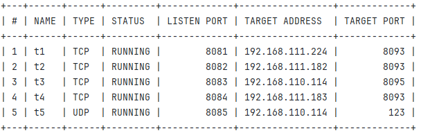
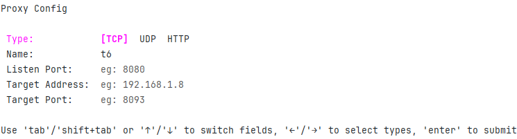

<h1 align="center">
    
</h1>

<p align="center">
   <a href="https://github.com/up-zero/my-proxy/fork" target="blank">
      
   </a>
   <a href="https://github.com/up-zero/my-proxy/stargazers" target="blank">
      
   </a>
   <a href="https://github.com/up-zero/my-proxy/pulls" target="blank">
      
   </a>
   <a href='https://github.com/up-zero/my-proxy/releases'>
      
   </a>
</p>

局域网代理工具，支持 TCP、UDP 等协议的代理转发，适用于绝大多数网络环境。提供了命令行、WebUI 两种配置代理的方法，极大地简化了代理配置的步骤。

## WebUI 模式

+ 登录

+ 代理管理

## 命令模式

+ 启动服务

```bash
# 默认服务端口 12312
my-proxy serve
# 指定服务端口
my-proxy serve -p 12312
```

+ 代理状态

```bash
# 默认查看所有代理的状态
my-proxy status
# 查看指定代理的状态
my-proxy status <name>
```



+ 代理管理

```bash
# 启动代理
my-proxy start <name>

# 停止代理
my-proxy stop <name>

# 重启代理
my-proxy restart <name>

# 创建代理
my-proxy create <name>

# 编辑代理
my-proxy edit <name>

# 删除代理
my-proxy delete <name>
```

对于代理的创建、编辑方面，提供了交互式的命令行界面，方便用户进行操作。



## 部署

1. 上传 `my-proxy` 可执行文件到 `/usr/local/bin` 中目录

2. 安装 `supervisor`，创建 `/etc/supervisor/conf.d/my-proxy.conf` 文件（说明：不同版本的 supervisor 配置文件的路径不同，例如 Centos 需要创建 /etc/supervisord.d/my-proxy.ini 文件 ），内容如下：
```conf
[program:my-proxy]
#启动命令
command=/usr/local/bin/my-proxy serve
#自动启动
autostart=true
#自动重启
autorestart=true
#环境变量
environment=HOME="/root"
```

3. 重载 `supervisor` 配置，并启动服务

```bash
sudo supervisorctl reread
sudo supervisorctl update
sudo supervisorctl restart my-proxy
```

4. 使用以下命令能获取到版本信息，说明安装成功了

```bash
my-proxy info

# 输出如下所示的信息
my-proxy 1.0.0
+----------+-------------------------+
| Address  | http://10.0.0.11:12312  |
|          | http://172.17.0.1:12312 |
| Username | admin                   |
| Password | KDi7tW6Y                |
+----------+-------------------------+
```
