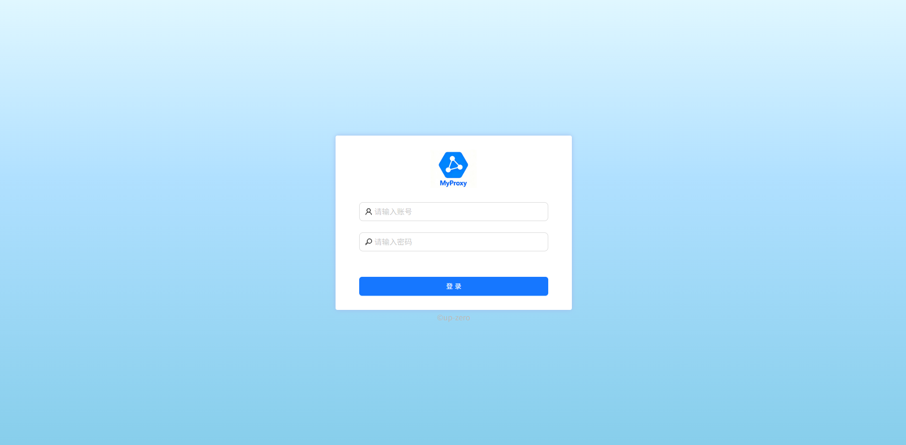

<div align="center">
    
</div>

<p align="center">
   <a href="https://github.com/up-zero/my-proxy/fork" target="blank">
      
   </a>
   <a href="https://github.com/up-zero/my-proxy/stargazers" target="blank">
      
   </a>
   <a href="https://github.com/up-zero/my-proxy/pulls" target="blank">
      
   </a>
   <a href='https://github.com/up-zero/my-proxy/releases'>
      
   </a>
</p>

<p align="center">
   English | <a href="./README_zh.md">中文</a>
</p>

A LAN proxy tool that supports proxy forwarding for TCP, UDP, HTTP, SOCKS5, and other protocols, making it suitable for most network environments. It provides both CLI and WebUI configuration modes, greatly simplifying proxy setup.

## WebUI Mode

+ Login



+ Proxy Management


## CLI Mode

+ Start the service

```bash
# Default service port: 12312
my-proxy serve
# Specify a custom service port
my-proxy serve -p 12312
```

+ Proxy status

```bash
# View the status of all proxies by default
my-proxy status
# View the status of a specific proxy
my-proxy status <name>
```


+ Proxy management

```bash
# Start a proxy
my-proxy start <name>

# Stop a proxy
my-proxy stop <name>

# Restart a proxy
my-proxy restart <name>

# Create a proxy with the TUI
my-proxy create <name>
# Quick create
my-proxy create --name my_proxy --type TCP --lport 9090 --taddr 192.168.1.1 --tport 9000

# Edit a proxy
my-proxy edit <name>

# Delete a proxy
my-proxy delete <name>
```

Interactive command-line interfaces are provided for creating and editing proxies, making operation more convenient.


## Deployment

1. Upload the `my-proxy` executable to `/usr/local/bin`.

2. Install `supervisor`, then create `/etc/supervisor/conf.d/my-proxy.conf` (note: the configuration path may vary by supervisor version; for example, on CentOS you may need to create `/etc/supervisord.d/my-proxy.ini`). Use the following content:

```conf
[program:my-proxy]
# start command
command=/usr/local/bin/my-proxy serve
# start automatically
autostart=true
# restart automatically
autorestart=true
# environment variable
environment=HOME="/root"
```

3. Reload the `supervisor` configuration and start the service.

```bash
sudo supervisorctl reread
sudo supervisorctl update
sudo supervisorctl restart my-proxy
```

4. Run the following command to retrieve version information. If it returns output similar to the example below, the installation was successful.

```bash
sudo my-proxy info

# Example output
my-proxy 1.0.0
+----------+-------------------------+
| Address  | http://10.0.0.11:12312  |
|          | http://172.17.0.1:12312 |
| Username | admin                   |
| Password | KDi7tW6Y                |
+----------+-------------------------+
```

## Docker Deployment

Run it with `docker run`:

```bash
# Create the mount directory
mkdir -p my-proxy/data

# Start the container
docker run -d \
    --name my-proxy-service \
    --restart always \
    --network host \
    -v "./my-proxy/data:/root/.config/my-proxy" \
    getcharzp/my-proxy:1.0.0

# View the login account
docker logs my-proxy-service | grep "admin"
```

## Build

```bash
# linux amd64
GOOS=linux GOARCH=amd64 go build -ldflags="-s -w" -o my-proxy-amd64

# linux arm64
GOOS=linux GOARCH=arm64 go build -ldflags="-s -w" -o my-proxy-arm64

# windows amd64
GOOS=windows GOARCH=amd64 go build -ldflags="-s -w" -o my-proxy-amd64.exe
```


