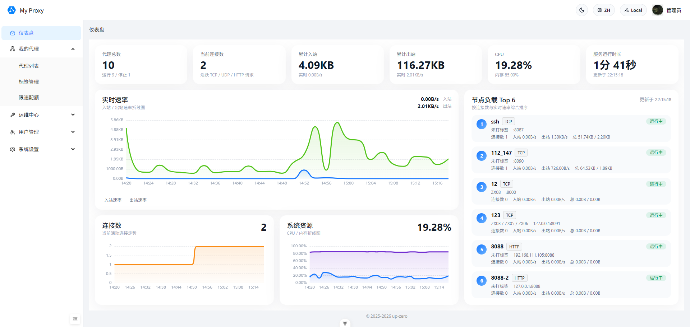
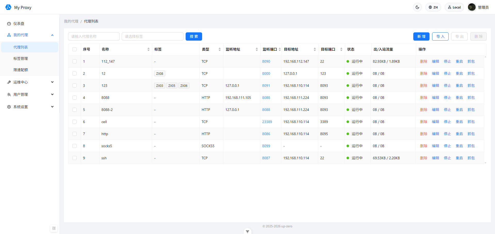
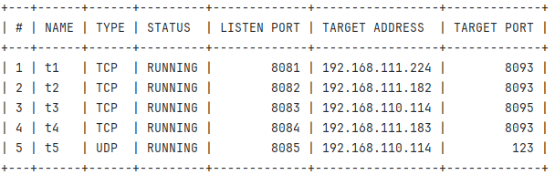
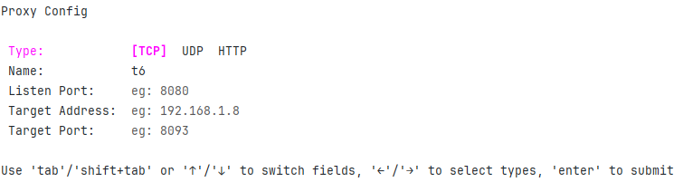

<div align="center">
    
</div>

<p align="center">
   <a href="https://github.com/up-zero/my-proxy/fork" target="blank">
      
   </a>
   <a href="https://github.com/up-zero/my-proxy/stargazers" target="blank">
      
   </a>
   <a href="https://github.com/up-zero/my-proxy/pulls" target="blank">
      
   </a>
   <a href='https://github.com/up-zero/my-proxy/releases'>
      
   </a>
</p>

<p align="center">
   <a href="./README.md">English</a> | 中文
</p>

局域网代理工具，支持 TCP、UDP、HTTP、SOCKS5 等协议的代理转发，适用于绝大多数网络环境。提供了命令行、WebUI 两种配置代理的方法，极大地简化了代理配置的步骤。支持多节点管理，通过一个面板统一管控多个 my-proxy 实例。

## WebUI 模式

+ 仪表盘


+ 代理管理


## 命令模式

+ 启动服务

```bash
# 默认服务端口 12312
my-proxy serve
# 指定服务端口
my-proxy serve -p 12312
```

+ 代理状态

```bash
# 默认查看所有代理的状态
my-proxy status
# 查看指定代理的状态
my-proxy status <name>
```



+ 终端仪表盘

```bash
# 打开终端资源监控面板
my-proxy stats

# 自定义刷新间隔
my-proxy stats --interval 2s
```

终端统计面板会同步展示 Web 仪表盘中的核心数据元素，包括汇总指标、实时速率走势、连接数走势、系统资源占用以及节点负载 Top 列表。按 `r` 立即刷新，按 `q` 退出。

+ 代理管理

```bash
# 启动代理
my-proxy start <name>

# 停止代理
my-proxy stop <name>

# 重启代理
my-proxy restart <name>

# TUI创建代理
my-proxy create <name>
# 快速创建代理
my-proxy create --name my_proxy --type TCP --lport 9090 --taddr 192.168.1.1 --tport 9000

# 编辑代理
my-proxy edit <name>

# 删除代理
my-proxy delete <name>
```

对于代理的创建、编辑方面，提供了交互式的命令行界面，方便用户进行操作。



## 部署

### Linux / macOS 一键安装

直接从 GitHub Releases 安装最新版本：

```bash
curl -fsSL https://raw.githubusercontent.com/up-zero/my-proxy/master/scripts/install.sh | bash
```

安装指定版本、自定义安装目录或自定义服务端口：

```bash
# 安装指定版本
curl -fsSL https://raw.githubusercontent.com/up-zero/my-proxy/master/scripts/install.sh | MY_PROXY_VERSION=v1.0.0 bash

# 安装到用户目录
curl -fsSL https://raw.githubusercontent.com/up-zero/my-proxy/master/scripts/install.sh | INSTALL_DIR="$HOME/.local/bin" bash

# 修改服务端口
curl -fsSL https://raw.githubusercontent.com/up-zero/my-proxy/master/scripts/install.sh | MY_PROXY_SERVICE_PORT=12312 bash
```

安装完成后，可以执行 `my-proxy version` 验证二进制是否可用，再按安装脚本输出的状态命令检查服务运行情况。

### 使用 supervisor 手动部署（Linux）

1. 上传 `my-proxy` 可执行文件到 `/usr/local/bin` 中目录

2. 安装 `supervisor`，创建 `/etc/supervisor/conf.d/my-proxy.conf` 文件（说明：不同版本的 supervisor 配置文件的路径不同，例如 Centos 需要创建 /etc/supervisord.d/my-proxy.ini 文件 ），内容如下：
```conf
[program:my-proxy]
#启动命令
command=/usr/local/bin/my-proxy serve
#自动启动
autostart=true
#自动重启
autorestart=true
#环境变量
environment=HOME="/root"
```

3. 重载 `supervisor` 配置，并启动服务

```bash
sudo supervisorctl reread
sudo supervisorctl update
sudo supervisorctl restart my-proxy
```

4. 使用以下命令能获取到版本信息，说明安装成功了

```bash
sudo my-proxy info

# 输出如下所示的信息
my-proxy 1.1.0
+----------+-------------------------+
| Address  | http://10.0.0.11:12312  |
|          | http://172.17.0.1:12312 |
| Username | admin                   |
| Password | KDi7tW6Y                |
+----------+-------------------------+
```

## Docker 部署

通过 `docker run` 的方式运行：

```bash
# 创建挂载目录
mkdir -p my-proxy/data

# 启动容器
docker run -d \
    --name my-proxy-service \
    --restart always \
    --network host \
    -v "./my-proxy/data:/root/.config/my-proxy" \
    getcharzp/my-proxy:1.1.0

# 查看登录账号
docker logs my-proxy-service | grep "admin"
```

## 构建

```bash
# Linux / macOS
./scripts/build-release.sh --version 1.1.0 --clean
```
